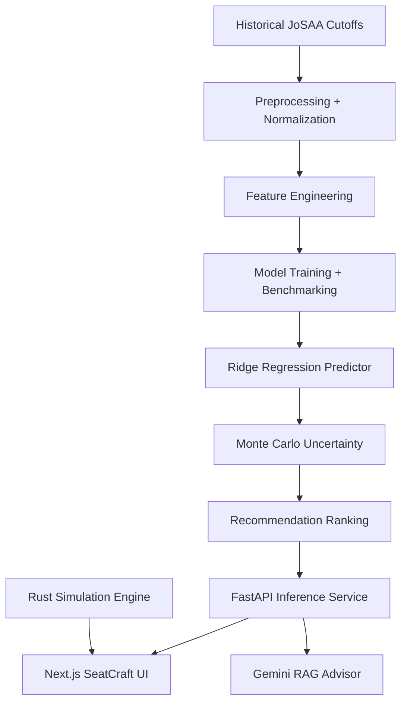

# SeatCraft: JoSAA Probabilistic Counselling Planner

SeatCraft is an end-to-end decision-support system for JoSAA-style engineering admissions. It turns historical cutoff data into probability-aware college and branch recommendations, with uncertainty intervals, safety labels, a FastAPI ML inference service, and a Gemini-backed RAG counselling assistant.

## Why This Exists

JoSAA choice filling is a high-stakes ranking problem. A deterministic cutoff estimate like "CSE closes around 5000" is brittle because cutoffs move with seat matrices, category pools, round dynamics, applicant volume, and policy changes.

This project frames the problem as probabilistic decision support:

- Predict the likely closing rank for each eligible program.
- Estimate uncertainty from historical residual behavior.
- Convert a student's rank into admission probability.
- Rank options by probability and safety margin.
- Explain recommendations through a Gemini-powered counselling assistant.

## System Overview



## Repository Layout

- `models/`: offline ML pipeline, feature engineering, model training, benchmarking, evaluation, and saved artifacts.
- `inference_service/`: FastAPI service for loading artifacts, validating requests, predicting cutoffs, running Monte Carlo simulation, and returning ranked recommendations.
- `sim_engine/`: Rust simulation engine for high-performance quota-routing experiments and validation.
- `rag_service/`: FastAPI + LangChain + Gemini RAG service for document-grounded counselling answers.
- `seatcraft/`: Next.js frontend for rank intake, recommendation tables, saved choices, volatility inspection, and chat.

## Data And Splits

The dataset aggregates historical JoSAA cutoff data from 2016-2025 where available, with normalized institute, branch, quota, category, gender, rank, and round fields.

The ML pipeline uses temporal splits instead of random splits:

- Train: 2016-2023
- Validation: 2024
- Test: 2025 where available

This avoids random-split leakage and better matches the real forecasting task: predicting future counselling behavior from prior years.

## Modeling

The main predictive target is `closing_rank`. The selected model is L2-regularized Ridge Regression with high-cardinality categorical encodings and scaled numerical features.

Six regressors were benchmarked:

| Model | Test MAE | Test RMSE | Test R2 | Status |
|:---|---:|---:|---:|:---|
| Ridge | 2.43 | 5.59 | 1.000 | Selected |
| ExtraTrees | 1798.11 | 6884.59 | 0.970 | Archived |
| LightGBM | 2069.21 | 8397.43 | 0.955 | Archived |
| HistGradientBoosting | 2266.77 | 8753.11 | 0.951 | Archived |
| XGBoost | 2279.95 | 10581.52 | 0.928 | Archived |
| RandomForest | 2433.28 | 7483.42 | 0.964 | Archived |

Ridge won because cutoff movement is strongly temporal and often near-linear after normalization. Tree-based models handled interactions well but struggled to extrapolate future rank trends.

## Recommendation Logic

For every eligible option, the inference service:

1. Filters the program universe by category, gender, round, PwD flag, institute type, and branch keywords.
2. Excludes IIT options unless a JEE Advanced rank is provided.
3. Avoids unverifiable Home State rows unless institute-state metadata proves the row applies.
4. Predicts the closing rank.
5. Samples `N=1000` Monte Carlo draws using empirical residual standard deviations with a volatility floor.
6. Computes admission probability and a 90% interval.
7. Ranks options by probability and normalized safety margin.

Safety labels:

- Safe: probability >= 0.80
- Moderate: 0.40 <= probability < 0.80
- Ambitious: probability < 0.40

## Services

Default local ports:

| Service | Port | Purpose |
|:---|---:|:---|
| Rust API | 8080 | Independent simulator at `/api/simulate` |
| RAG API | 8081 | Gemini counselling advisor at `/api/rag/*` |
| ML API | 8082 | Inference at `/api/v1/predict` and `/api/v1/chat-context` |
| Frontend | 3000 | SeatCraft web app |

## Run With Docker

```bash
docker-compose up --build
```

To run the one-off Rust ingest job:

```bash
docker compose --profile ingest up ingest
```

## Run Locally

Python environment:

```bash
conda env create -f environment.yml
conda activate josaa_analytics
```

ML pipeline:

```bash
cd models
python preprocessing.py
python eda_features.py
python train_models.py
python recommendation.py
python evaluation.py
```

Inference service:

```bash
cd inference_service
pip install -r requirements.txt
uvicorn main:app --host 0.0.0.0 --port 8082 --reload
```

RAG service:

```bash
cd rag_service
pip install -r requirements.txt
GOOGLE_API_KEY=your_key uvicorn main:app --host 0.0.0.0 --port 8081 --reload
```

Rust simulator, optional:

```bash
cd sim_engine
cargo run --bin server
```

Frontend:

```bash
cd seatcraft
npm install
npm run dev
```

Set frontend service URLs when needed:

```bash
NEXT_PUBLIC_API_URL=http://localhost:8080
NEXT_PUBLIC_ML_URL=http://localhost:8082
NEXT_PUBLIC_RAG_URL=http://localhost:8081
```

## Validation

Useful checks:

```bash
cd seatcraft && npm run lint
cd seatcraft && npm run build
cd sim_engine && cargo test
python3 -m py_compile models/preprocessing.py models/eda_features.py models/train_models.py models/evaluation.py models/recommendation.py models/predict.py inference_service/main.py rag_service/main.py
```

Python tests live under `inference_service/tests/` and require the Python test dependencies plus model artifacts:

```bash
cd inference_service
pytest tests -q
```

## Current Limitations

- The system predicts branch-level cutoff behavior, not individual allocation guarantees.
- Public cutoff data reflects historical seat matrices and policy conditions; sudden policy changes can break assumptions.
- EWS has a shorter longitudinal history than older categories.
- ML Home State filtering is conservative unless institute-state metadata is available in the loaded universe.
- Some report artifacts are generated by scripts; regenerate them after changing the modeling pipeline.

## Strong Interview Talking Points

- Strict temporal validation instead of random splits.
- Clear model selection rationale: Ridge outperforms tree ensembles because extrapolation matters.
- Monte Carlo uncertainty turns point estimates into decision-support probabilities.
- FastAPI services are separated by responsibility: inference and RAG are independently deployable.
- Rust simulator provides a performant independent path for quota-routing experiments.
- Frontend recommendations use the ML inference service backed by `models/model_artifacts`.
- Gemini-backed RAG grounds counselling answers in uploaded documents and recommendation context.

## Future Work

- Add conformal prediction for distribution-free interval guarantees.
- Add institute-state metadata to enable exact ML Home State quota routing.
- Train a learning-to-rank model for multi-objective recommendation ordering.
- Add end-to-end Playwright tests that verify the UI hits ML inference before falling back.
- Persist RAG vectors so uploaded counselling documents survive service restarts.
