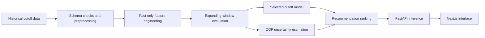
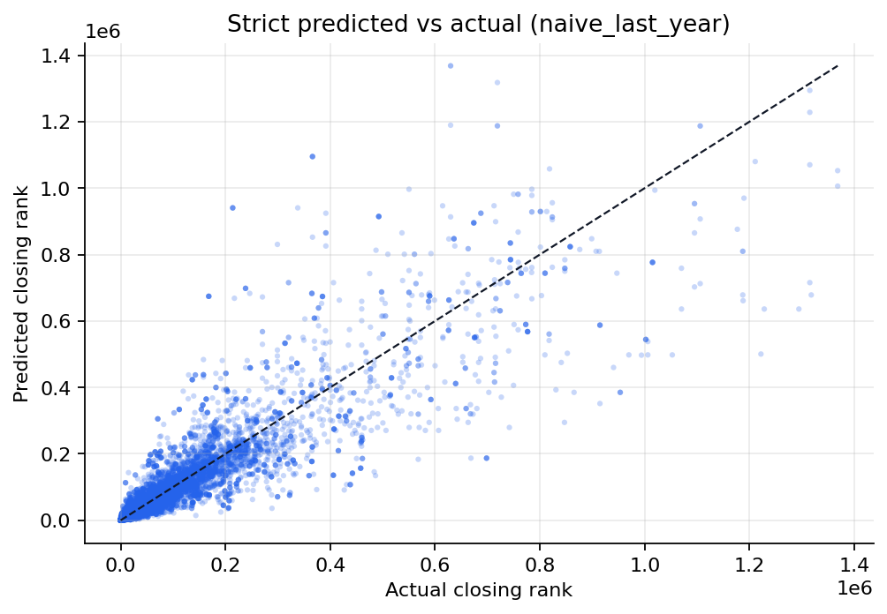
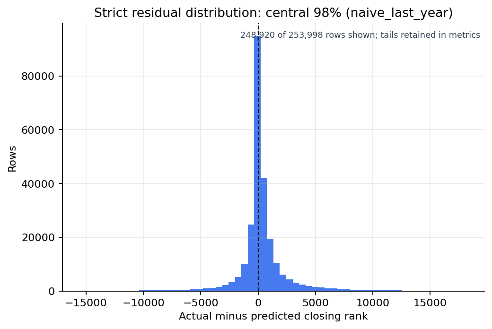
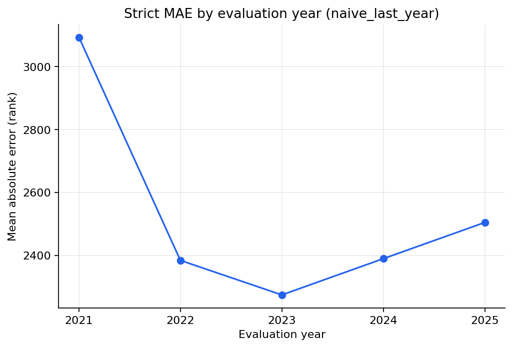
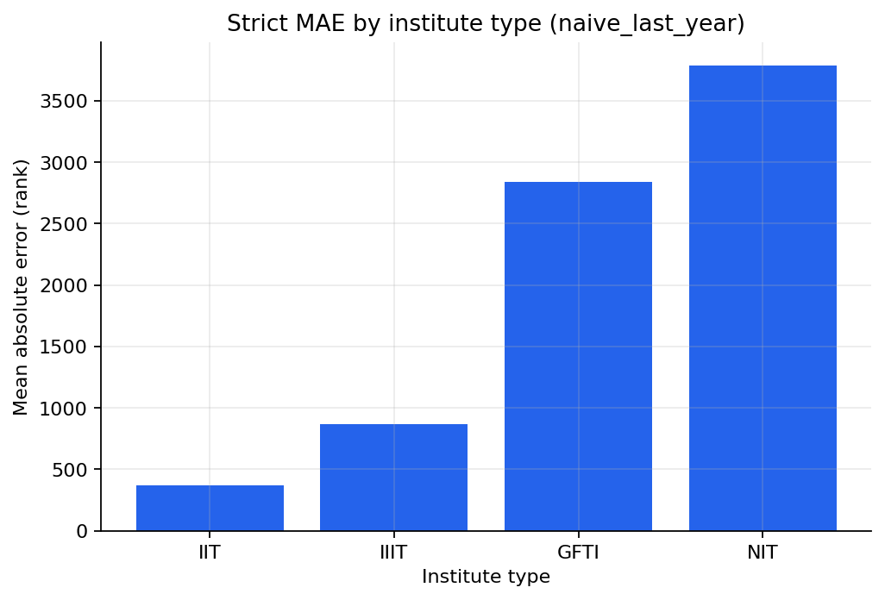
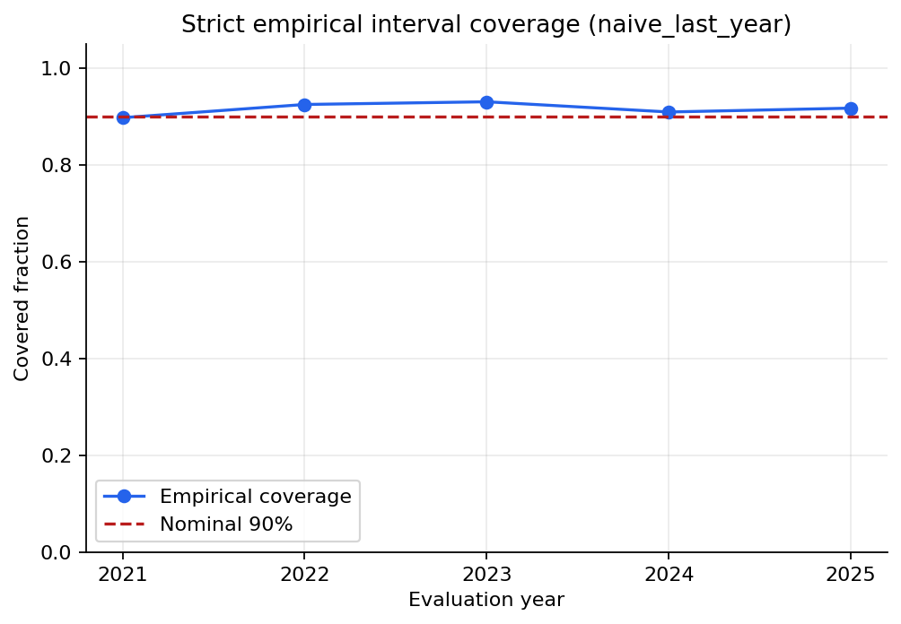
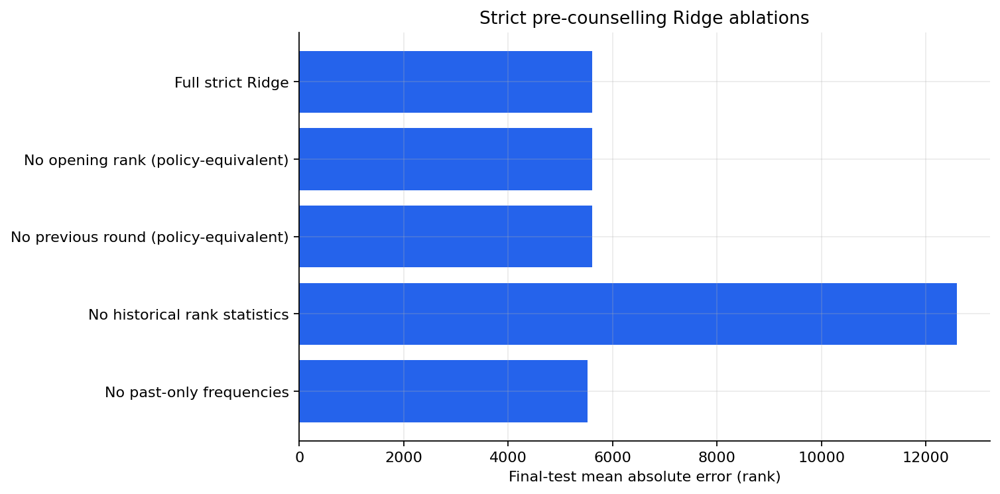
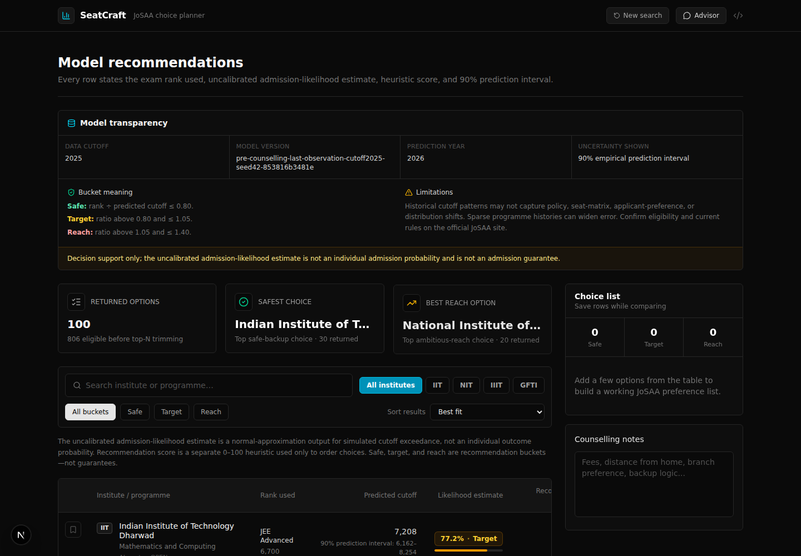

# SeatCraft

## Uncertainty-Aware Temporal Forecasting and Retrieval-Augmented Decision Support for JoSAA Counselling

> **Ongoing undergraduate research prototype.** SeatCraft is a functioning decision-support system and a reproducible, leakage-aware ML study. It is not a published paper, an official JoSAA service, or an admission guarantee.

[](LICENSE)

**Stack:** Python 3.12 · FastAPI · Next.js 16 · Gemini and FAISS (optional RAG path)<br>
**Evidence window:** 2016–2025 · **Final evaluation:** 2025 · **Serving frame:** 2026<br>
**Detailed methods:** [Technical report](docs/TECHNICAL_REPORT.md)

| 30-second evidence    | Current finding                                                                                             |
| --------------------- | ----------------------------------------------------------------------------------------------------------- |
| Research problem      | Forecast future JoSAA closing ranks without using target-season information                                 |
| Selected strict model | Last-year cutoff baseline, selected on rolling origins 2021–2024                                            |
| Isolated 2025 result  | MAE **2,504.75** on **52,831** matched rows; median absolute error **422**                                  |
| Uncertainty           | Nominal 90% empirical prediction interval: **91.70%** coverage, **8,646.75** mean width                     |
| Critical boundary     | The prior-year universe covers only **74.77%** of observed 2025 rows                                        |
| Main limitation       | Local data are hash-bound, but acquisition provenance, license, and redistribution authority are unresolved |

## Abstract

SeatCraft is an ongoing undergraduate research prototype for uncertainty-aware decision support during Joint Seat Allocation Authority (JoSAA) counselling. The research problem is to forecast programme-level closing ranks using only
information available before a target counselling season, while avoiding the same-season leakage that can make retrospective prediction appear unrealistically accurate. The current study uses a locally processed longitudinal table of
aggregate opening and closing ranks for IIT, NIT, IIIT, and GFTI programme, category, quota, gender-pool, PwD, and round strata. It evaluates last-observation, historical-mean, Ridge, and histogram-gradient-boosting estimators with
expanding-window origins, pre-final model selection, and an isolated 2025 test. Earlier rolling-origin residuals define empirical prediction intervals; a separate normal Monte Carlo approximation supplies an explicitly uncalibrated
cutoff-exceedance likelihood estimate. A multi-objective layer combines rank fit, admissibility, programme heuristics, and institute heuristics without presenting the final score as a probability. The software exposes these results through
FastAPI and Next.js. An experimental Gemini/FAISS path retrieves excerpts from uploaded counselling documents and supplies them, with model context, to a language model. The strict 2025 result selects the simple last-year baseline, not a
more complex model. Its main limitation is external validity: the source and redistribution history of the local processed dataset is not yet verified, and new or changed programme rows are incompletely covered.

## Review paths

- **30 seconds:** title, abstract, evidence table, and [limitations](#limitations).
- **3 minutes:** [questions](#research-questions), [architecture](#system-architecture), [design](#experimental-design), [results](#results-and-evidence), and [roadmap](#research-roadmap).
- **15 minutes:** follow the [technical report](docs/TECHNICAL_REPORT.md), [canonical metrics](research/reports/metrics.json), [artifact manifest](research/reports/artifact_manifest.json), [tests](#testing-and-verification), and
  [reproduction commands](#reproducibility).

## Contents

- [Research motivation](#research-motivation)
- [Research questions](#research-questions)
- [Hypotheses](#hypotheses)
- [Current project contributions](#current-project-contributions)
- [System architecture](#system-architecture)
- [Repository structure](#repository-structure)
- [Dataset and provenance](#dataset-and-provenance)
- [Feature-availability policy](#feature-availability-policy)
- [Experimental design](#experimental-design)
- [Baselines and model comparison](#baselines-and-model-comparison)
- [Ablation study](#ablation-study)
- [Uncertainty methodology](#uncertainty-methodology)
- [Recommendation formulation](#recommendation-formulation)
- [RAG research component](#rag-research-component)
- [Results and evidence](#results-and-evidence)
- [Illustrative case study](#illustrative-case-study)
- [Reproducibility](#reproducibility)
- [Testing and verification](#testing-and-verification)
- [Limitations](#limitations)
- [Research roadmap](#research-roadmap)
- [Potential Research Extensions](#potential-research-extensions)
- [Contribution statement](#contribution-statement)
- [References and citation](#references-and-citation)

## Research motivation

Historical cutoff lookup is useful, but deterministic matching is not a sufficient model of a future counselling season:

- preferences, exam populations, seat matrices, programme names, and policy can shift over time;
- category, quota, gender-pool, PwD, institute type, and round interact;
- new or renamed programmes have sparse or no longitudinal histories;
- EWS has a shorter history than older seat categories;
- IIT choices consume JEE Advanced rank, while NIT/IIIT/GFTI choices consume JEE Main rank;
- a point cutoff hides uncertainty and heavy-tailed forecast errors; and
- constructing a choice list is a multi-objective ranking problem, not a single binary prediction.

The technical difficulty is therefore not CRUD or table filtering. It is to define a decision-time estimand, prevent future information from entering features or candidate universes, evaluate chronologically, quantify uncertainty, route the
correct rank source, and communicate heuristic trade-offs without misrepresenting them as calibrated admission outcomes.

## Research questions

| Question                                                                                                                             | Current status                                                                                                               |
| ------------------------------------------------------------------------------------------------------------------------------------ | ---------------------------------------------------------------------------------------------------------------------------- |
| **RQ1.** How accurately can a future closing rank be forecast using only pre-season information?                                     | Completed strict rolling-origin comparison; evidence is conditional on prior-universe matches                                |
| **RQ2.** How much can contemporaneous opening or completed-round information change apparent performance?                            | Opening-rank leakage diagnostic completed but confounded; Round-5 in-round diagnostic is secondary, not the primary estimand |
| **RQ3.** Do past-only residual intervals provide useful risk information beyond point estimates?                                     | 2025 coverage measured; formal conformal calibration and subgroup coverage remain open                                       |
| **RQ4.** How should likelihood, rank fit, and desirability be combined without calling a heuristic a probability?                    | Separation is implemented and tested; preference/utility evaluation remains open                                             |
| **RQ5.** Can retrieval-augmented generation explain recommendations while remaining grounded in official documents and model output? | Ingestion/retrieval/generation path implemented; faithfulness and citation evaluation are proposed                           |

## Hypotheses

| Hypothesis                                                                         | Evidence status                                                                                                                         |
| ---------------------------------------------------------------------------------- | --------------------------------------------------------------------------------------------------------------------------------------- |
| Past cutoff history will outperform a historical-mean baseline on MAE              | Supported on the declared validation origins and 2025 matched cohort by the selected last-year rule; not a universal claim              |
| Same-season opening rank will inflate apparent performance                         | A leakage stress test is consistent with this concern, but it also observes the target-year universe and is not a clean causal ablation |
| Past-only residual intervals will achieve measurable empirical coverage            | Supported descriptively for the isolated 2025 matched cohort; no formal coverage guarantee                                              |
| Separating likelihood from desirability will improve interpretability              | Separation is implemented; human interpretability has not yet been evaluated                                                            |
| Retrieved official context will ground answers better than an ungrounded assistant | Proposed; no RAG evaluation dataset or comparative result yet                                                                           |

## Current project contributions

Carefully scoped current contributions are:

- a leakage-aware temporal forecasting pipeline with an explicit pre-counselling feature policy;
- prior-snapshot candidate-universe construction and expanding-window evaluation;
- last-year, historical-mean, Ridge, and nonlinear executed comparisons;
- earlier-origin empirical prediction intervals and coverage reporting;
- JEE Main versus JEE Advanced rank routing for eligible institute types;
- separate likelihood, fit, desirability, safety, and final recommendation scores;
- safe-backup, realistic-target, ambitious-reach, and excluded-unlikely grouping;
- subgroup and feature-family error diagnostics with declared evidence limits;
- a FastAPI inference contract and responsive Next.js comparison interface;
- PDF/image ingestion, Gemini embeddings, in-memory FAISS retrieval, and Gemini answer generation;
- reproducible machine-readable evidence, artifact hashes, contract tests, and failure-visible services.

These are project contributions, not claims of methodological novelty.

## System architecture



The optional document-grounding path is independent of model training:


The primary path requires neither Rust nor PostgreSQL. The optional Rust module is described only in the [contribution statement](#contribution-statement).

## Repository structure

```text
apps/
├── web/                 Next.js interface, unit tests, and Playwright flows
├── inference-api/       FastAPI cutoff inference and recommendation service
└── rag-api/             FastAPI document-grounding and Gemini/FAISS service
packages/
└── josaa-core/          Shared feature-time policy and temporal feature builders
research/
├── data/                Local, ignored research inputs and derived data
├── pipeline/            Strict evaluator plus blocked legacy entry points
├── artifacts/           Serving model, universe, schema, metadata, and calibration
└── reports              Canonical JSON/CSV evidence and generated figures
scripts/                 Asset, README, provider, secret, and project verification
docs/                    Technical report, development guide, and current UI images
optional/rust-sim/       Collaborator-contributed optional simulator experiment
```

The tree above reflects current paths; it does not document planned directories.

## Dataset and provenance

| Property               | Current evidence                                                                                                  |
| ---------------------- | ----------------------------------------------------------------------------------------------------------------- |
| Processed table        | `research/data/processed/josaa_cleaned.csv` (local and ignored)                                                   |
| Evaluated years        | 2016–2025; partial 2026 rows are explicitly excluded                                                              |
| Rows                   | 508,184 evaluated; 521,160 local rows total; 12,976 post-cutoff 2026 rows excluded                               |
| Institute types        | IIT, NIT, IIIT, and GFTI                                                                                          |
| Unit of observation    | Institute × programme × category × quota × gender pool × PwD × round × year                                       |
| Primary fields         | Year, round, institute/type, programme, degree/duration, category, quota, gender, PwD, opening rank, closing rank |
| Canonical hash         | `6fa3ff7ec8f6823a4ff158ec2b1c49fc79d7f81d23255420803c8ec604045039`                                                |
| Validated quality      | 0 missing required-field cells; 0 duplicate outcome-key rows; 785 opening-rank > closing-rank rows preserved    |
| Provenance             | Unverified acquisition chain                                                                                      |
| License/redistribution | Unresolved / not authorized for redistribution                                                                    |

The repository's MIT license covers its software; it does not grant rights to
the provenance-unverified cutoff datasets or collaborator fixtures.

The preprocessing code parses ranks, normalizes category/quota/gender/PwD labels, derives institute and programme metadata, drops duplicate natural keys, exports normalization mappings, and retains source filename/row trace fields. The
strict evaluator independently rejects missing required columns, null targets, and duplicate year/outcome identities.

The official [JoSAA archive](https://josaa.nic.in/archive/) is the intended future verification and acquisition route. It is **not** evidence that the current local CSV came from that route. JoSAA's
[copyright policy](https://josaa.nic.in/copyright-policy/) also makes permission and acknowledgement part of any redistribution decision. A clean clone therefore fails closed instead of downloading an unverified substitute.

See [Dataset and provenance](docs/TECHNICAL_REPORT.md#3-dataset-and-provenance) for the data dictionary, cleaning path, gaps, and distribution-shift risks.

## Feature-availability policy

| Feature                                 |           Pre-counselling available? |               In-round available? | Used in selected primary model? | Leakage risk                                                    |
| --------------------------------------- | -----------------------------------: | --------------------------------: | ------------------------------: | --------------------------------------------------------------- |
| Target year                             |                                  Yes |                               Yes |                              No | Low when declared before the season                             |
| Planned round                           |                                  Yes |                               Yes |                   Identity only | Low; must not derive final-round status from target data        |
| Institute/programme identity            |             Yes, from prior snapshot |                               Yes |                  Group identity | Target-universe leakage if copied from the observed target year |
| Category, quota, gender, PwD            |             Yes, from prior snapshot |                               Yes |                  Group identity | Normalization must be fit without future rows                   |
| Historical mean/std/count               |                 Yes, past years only |                               Yes |         No; used by comparators | High if not shifted before each origin                          |
| Historical min/max                      | Derivable past-only, not implemented |                              Same |                              No | Would leak if computed on the full table                        |
| Previous-year closing rank              |                                  Yes |                               Yes |                         **Yes** | Must come from a strictly earlier year                          |
| Previous-round closing rank             |                                   No | Yes, completed earlier round only |                              No | Target-season leakage in the primary task                       |
| Same-round opening rank                 |                                   No |                                No |                              No | Direct contemporaneous leakage                                  |
| Applicant count                         |        No verified pre-season source |                                No |                              No | Target-season/source-availability risk                          |
| Past-only institute/programme frequency |                                  Yes |                               Yes |          No; comparator feature | Full-table counts would leak validation/test composition        |

`pre_counselling` is the primary evidence mode. Same-round opening rank is never admitted. A completed earlier round is allowed only when the task is explicitly redefined as an in-round update.

## Experimental design

- **Data cutoff:** 2025; incomplete 2026 observations are ignored.
- **Warm-up residual origins:** 2019–2020.
- **Model-selection origins:** 2021–2024.
- **Final test:** 2025, evaluated only after selection by mean validation MAE.
- **Final training history:** years strictly before 2025; each earlier fold uses only its own past.
- **Serving frame:** the 2025 programme/profile snapshot is projected to 2026.
- **Candidates:** last year, historical mean, Ridge, and histogram gradient boosting.
- **Metrics:** MAE, RMSE, median absolute error, R², interval coverage/width, and prior-universe coverage.
- **Diagnostics:** feature-family ablations, leaky-opening stress test, in-round update, and descriptive subgroup errors.
- **Seed:** 42 for stochastic estimators and serving Monte Carlo.
- **Identity:** dataset, code, artifact, report, and figure hashes are recorded by the generated manifest.

Temporal splits are required because random row splits would allow later seasons to train predictions for earlier seasons and would overstate generalization.

## Baselines and model comparison

Experiment: strict pre-counselling expanding-window selection; all 2025 values refer to the same **52,831-row matched prior-universe cohort**.

| Model                       | Feature mode    | Validation MAE |     Test MAE |          RMSE |  Median AE |          R² |
| --------------------------- | --------------- | -------------: | -----------: | ------------: | ---------: | ----------: |
| **Last-year cutoff**        | Pre-counselling |   **2,535.46** | **2,504.75** |     18,241.87 | **422.00** |     0.79269 |
| Histogram gradient boosting | Pre-counselling |       2,878.39 |     2,661.17 | **15,922.81** |     715.56 | **0.84205** |
| Historical mean             | Pre-counselling |       3,279.50 |     3,041.86 |     16,143.33 |     578.57 |     0.83765 |
| Ridge                       | Pre-counselling |       6,800.97 |     5,609.05 |     16,162.10 |   3,612.28 |     0.83727 |

The simplest baseline wins the pre-declared validation MAE, RMSE, and median-error objectives. The nonlinear model has the best final RMSE and R², while the selected baseline retains the best final MAE and median error. This is a useful negative result: model complexity is not hidden or selected after inspecting the final test.

The in-round Round-5 experiment uses completed earlier 2025 rounds and a different cohort/decision time. It is reported separately in the canonical metrics and technical report and must not be compared as if it were the primary pre-season
test.

## Ablation study

The selected estimator has one historical input, so feature-family ablations use the availability-correct Ridge comparator.

| Configuration                        | Features removed                               |                2025 Test MAE | Change vs full | Interpretation                                                      |
| ------------------------------------ | ---------------------------------------------- | ---------------------------: | -------------: | ------------------------------------------------------------------- |
| Full pre-counselling Ridge           | None                                           |                     5,609.05 |              — | Availability-correct comparator                                     |
| Without opening-rank features        | Same-round opening is forbidden by policy      |                     5,609.05 |           0.00 | Policy identity, not a separately trained richer model              |
| Without previous-round closing rank  | Previous round is forbidden in pre-season mode |                     5,609.05 |           0.00 | Policy identity for the primary estimand                            |
| Without historical statistics        | Past cutoff summaries and last observation     |                    12,598.15 |      +6,989.10 | Historical dependence is material                                   |
| Without past-only frequency features | Past institute/programme counts                |                     5,524.69 |         -84.36 | The added counts did not improve Ridge MAE in this run               |

A separate legacy-opening diagnostic uses the observed 2025 row universe and same-round opening rank. It obtains MAE **3,347.09** on a different **70,659-row** cohort, is deliberately ineligible for the primary claim, and cannot be read as a clean causal ablation.

The non-primary in-round diagnostic forecasts 2025 Round 5 after Rounds 1–4 are complete. On the same **10,467-row** matched Round-5 cohort, Ridge with the previous-round fields obtains MAE **3,154.68** versus **5,637.73** without them. This is evidence about a later decision time, not a better pre-season result.

## Uncertainty methodology

For every rolling origin, residuals become calibration evidence only for later origins. The 2025 interval uses **288,592** absolute residuals from 2019–2024, never a 2025 residual. The global 90th-percentile radius is **4,173** ranks;
institute-type/round radii are used when support is sufficient.

- A **prediction interval** concerns a future closing-rank observation.
- It is not a confidence interval for a fitted mean or coefficient.
- The nominal 90% interval attains **91.70%** empirical coverage in the matched 2025 cohort.
- Mean interval width is **8,646.75** ranks.
- The method is empirical and past-only, but not a formal conformal guarantee.

For serving, the OOF radius is divided by 1.64485 to scale a normal approximation. With **1,000** deterministic-seed draws,

\[ \hat p_{\text{cutoff}}=\frac{1}{S}\sum_{s=1}^{S}\mathbf{1}[r\leq C_s], \qquad C_s\sim\max(1,\mathcal N(\hat c,\sigma^2)). \]

This is an **uncalibrated admission-likelihood estimate under the cutoff model**. Monte Carlo sampling does not create calibrated individual-outcome probabilities. Gaussian tails and temporal continuity are assumptions; policy or preference
shifts can break them.

## Recommendation formulation

For routed rank \(r\) and predicted cutoff \(\hat c\):

\[ \text{margin}=\hat c-r, \qquad \text{rank ratio}=r/\max(\hat c,1). \]

The system keeps five quantities distinct:

1. predicted closing rank;
2. empirical prediction interval;
3. uncalibrated admission-likelihood estimate;
4. rank-fit and institute/branch desirability heuristics; and
5. final recommendation score, used only for ordering.

The score combines admissibility, fit, cutoff competitiveness, institute type, and branch heuristics. Its weights are design choices, not learned preferences. Exact equations are in the
[recommendation methodology](docs/TECHNICAL_REPORT.md#11-recommendation-methodology).

| Group                   |   Rank-ratio rule | Decision-support meaning                             |
| ----------------------- | ----------------: | ---------------------------------------------------- |
| Safe backup             |            ≤ 0.80 | Rank is comfortably better than the projected cutoff |
| Best realistic / target | > 0.80 and ≤ 1.05 | Near the projected cutoff                            |
| Ambitious reach         | > 1.05 and ≤ 1.40 | Moderately harder than the projected cutoff          |
| Unlikely reach          |            > 1.40 | Excluded from normal returned results                |

Buckets are not fabricated to fill quotas. Only legitimate eligible rows are returned; missing buckets remain missing.

The retained regression profile is JEE Main rank **3,000**, JEE Advanced rank **6,700**, Round **6**, and at most **100** recommendations. IIT rows use Advanced; NIT/IIIT/GFTI rows use Main.

## RAG research component

The optional RAG service is an experimental explanation and document-grounding component:

1. validate PDF, PNG, JPEG, or WebP content and size;
2. extract page-aware PDF text or request image transcription/OCR from Gemini;
3. split content into bounded chunks with source/page/chunk metadata;
4. embed chunks with the configured Gemini embedding model;
5. retrieve similar chunks from an in-memory FAISS index;
6. combine excerpts with bounded ML recommendation context; and
7. ask Gemini to answer while returning retrieved source metadata/excerpts.

It does not prove that an answer cited an excerpt correctly, and retrieval does not eliminate hallucination. Vectors disappear on process restart.

Planned evaluation covers retrieval relevance, citation correctness, faithfulness, answer completeness, insufficient-context behaviour, OCR quality, and prompt-injection robustness. Defensive input/prompt tests exist; no benchmark score is
claimed.

## Results and evidence

| Evidence field       | Value                                                                      |
| -------------------- | -------------------------------------------------------------------------- |
| Experiment           | `seatcraft-strict-pre-counselling-2021-2025-seed42-1c009aa9f98bbf23`       |
| Dataset              | `local-unverified-cutoff-2025-6fa3ff7ec8f6`; canonical SHA-256 above       |
| Selection/evaluation | 2021–2024 / isolated 2025                                                  |
| Feature mode         | `pre_counselling`                                                          |
| Seed                 | 42                                                                         |
| Code state           | Commit `ee751d0f236961f612d867864d68abbb1d39d9ab`; dirty worktree recorded |
| Source of truth      | [`research/reports/metrics.json`](research/reports/metrics.json)           |

The commit alone does not identify this uncommitted evidence revision. The canonical JSON therefore also records source-file hashes and the manifest hashes every versioned output.

### Strict generated figures

Only figures generated by the strict evaluator are embedded below. Older plots from superseded same-season workflows remain unreferenced legacy material.













The supporting tables are the [fold metrics](research/reports/research_fold_metrics.csv), [model selection](research/reports/research_model_selection.csv), [ablations](research/reports/research_ablation_metrics.csv),
[in-round diagnostic](research/reports/research_in_round_diagnostic.csv), and [subgroup results](research/reports/research_subgroup_metrics.csv).



## Illustrative case study

This is a deterministic software walkthrough, **not proof of model accuracy**. Its values are generated into the canonical metrics file by calling the real local inference API after artifact generation.

**Input:** OPEN, Gender-Neutral, Round 6; JEE Main **3,000**; JEE Advanced **6,700**; `top_n=100`.

| Bucket          | Example                                            | Rank source    | Predicted cutoff | 90% prediction interval | Likelihood estimate | Recommendation score | Generated explanation summary |
| --------------- | -------------------------------------------------- | -------------- | ---------------: | ----------------------: | ------------------: | -------------------: | ----------------------------- |
| Safe backup     | IIT Jammu — Mathematics and Computing              | Advanced 6,700 |            8,559 |             7,333–9,785 |               99.3% |              81.6325 | Positive margin 1,859; estimate is simulated cutoff exceedance, not an individual outcome |
| Best realistic  | IIT Bhilai — Computer Science and Engineering      | Advanced 6,700 |            7,382 |             6,156–8,608 |               81.0% |              87.3435 | Positive margin 682; realistic bucket and likelihood label are separate policies |
| Ambitious reach | NIT Karnataka, Surathkal — Artificial Intelligence | Main 3,000     |            2,650 |                1–10,045 |               46.6% |              73.5010 | Negative margin 350; wide interval exposes substantial cutoff uncertainty |

The examples use different exam ranks by institute type. Wide or truncated intervals, heuristic programme preferences, unverified source provenance, and future policy/seat changes remain limitations.

## Reproducibility

Prerequisites are Python 3.12, Node 20+, npm, and optional Docker Compose. The default application does not require Rust, Cargo, or PostgreSQL.

<details>
<summary>Install and regenerate the strict evidence</summary>

```bash
python3 -m venv .venv
. .venv/bin/activate
python -m pip install -r requirements-dev.txt
npm --prefix apps/web ci
python scripts/check_assets.py
SOURCE_DATE_EPOCH=1783093190 python -m research.pipeline.research_evaluation \
  --data research/data/processed/josaa_cleaned.csv \
  --output-dir research/reports \
  --artifact-dir research/artifacts \
  --evaluation-years 2021 2022 2023 2024 2025 \
  --final-test-year 2025 \
  --data-cutoff-year 2025 \
  --prediction-year 2026
python scripts/verify_readme.py
```

The asset check fails closed on a clean clone until provenance-verified source data are supplied. No automatic downloader is provided.

</details>

<details>
<summary>Run the three services locally</summary>

```bash
python -m uvicorn inference_api.main:app --app-dir apps/inference-api/src --host 0.0.0.0 --port 8082
python -m uvicorn rag_api.main:app --app-dir apps/rag-api/src --host 0.0.0.0 --port 8081
npm --prefix apps/web run dev
```

The web interface is on port 3000, inference on 8082, and RAG on 8081. RAG is visibly degraded when `GOOGLE_API_KEY` is absent.

| Service       | Default URL                 | Primary endpoints                                                    |
| ------------- | --------------------------- | -------------------------------------------------------------------- |
| Next.js web   | `http://localhost:3000`     | Browser interface                                                    |
| Inference API | `http://localhost:8082`     | `GET /api/v1/health`, `POST /api/v1/predict`                         |
| RAG API       | `http://localhost:8081`     | `GET /health`, `POST /api/rag/upload`, `POST /api/rag/ask`           |

</details>

<details>
<summary>Run tests or Docker</summary>

```bash
python scripts/verify_project.py
docker compose config --quiet
docker compose config --services
docker compose up --build
```

Default Compose services are exactly `web`, `inference-api`, and `rag-api`. The collaborator Rust experiment requires the explicit `rust-sim` profile.

</details>

## Environment variables

The public contract is [.env.example](.env.example). Browser service URLs are optional build-time overrides with localhost defaults.

| Variable                                                                   | Purpose                                               |
| -------------------------------------------------------------------------- | ----------------------------------------------------- |
| `NEXT_PUBLIC_ML_URL`, `NEXT_PUBLIC_RAG_URL`                                | Optional browser API base URLs                        |
| `FRONTEND_PORT`, `INFERENCE_PORT`, `RAG_PORT`                              | Optional Compose host ports                           |
| `GOOGLE_API_KEY`                                                           | Optional Gemini credential; absence keeps RAG degraded |
| `RAG_LLM_MODEL`, `RAG_LLM_TEMPERATURE`, `RAG_LLM_MAX_TOKENS`               | Chat model and generation bounds                      |
| `RAG_EMBED_MODEL`, `RAG_TOP_K`                                             | Embedding model and retrieval count                   |
| `RAG_CHUNK_SIZE`, `RAG_CHUNK_OVERLAP`                                      | Chunk construction                                    |
| `RAG_REQUEST_TIMEOUT_SECONDS`, `RAG_PROVIDER_TIMEOUT_SECONDS`              | Request/provider time bounds                          |
| `RAG_MAX_UPLOAD_BYTES`, `RAG_MAX_INLINE_IMAGE_BYTES`                       | Upload and inline-image limits                        |
| `RAG_MAX_ML_CONTEXT_CHARS`                                                 | Recommendation-context size bound                     |
| `MC_N_SIMS`                                                                | Serving Monte Carlo draw count                        |
| `RUST_SIM_POSTGRES_PASSWORD`, `RUST_SIM_PORT`                              | Optional collaborator profile only                    |

Never overwrite an existing `.env`, print secrets, or commit environment files.

## Testing and verification

Status is reported only for commands executed against the final worktree. The machine-readable consolidated record is [`research/reports/verification/verification_report.json`](research/reports/verification/verification_report.json).

| Layer               | What is tested                                          | Command                                                                 | Current status       |
| ------------------- | ------------------------------------------------------- | ----------------------------------------------------------------------- | -------------------- |
| Feature engineering | Past-only statistics/frequencies and target frames      | `python -m pytest research/pipeline/tests -q`                           | PASSED (29 tests)    |
| Leakage guards      | Forbidden features, final-test isolation, OOF intervals | same research suite                                                     | PASSED (29 tests)    |
| Model evidence      | Selection, metrics, hashes, figures, case-study payload | same research suite                                                     | PASSED (29 tests)    |
| Inference API       | Artifacts, routes, validation, rank routing, buckets    | `python -m pytest apps/inference-api/tests -q`                          | PASSED (135 tests)   |
| RAG pipeline        | Validation, extraction, retrieval, prompt boundaries    | `python -m pytest apps/rag-api/tests -q`                                | PASSED (27 tests)    |
| Gemini integration  | Dependency-injected mocked gateway                      | same RAG suite                                                          | PASSED (27 tests)    |
| Live Gemini         | Real embedding and chat calls, opt-in                   | `RUN_LIVE_GEMINI_TEST=1 python scripts/verify_gemini.py`                | LIVE GEMINI: PASSED  |
| Frontend unit       | Sorting and bucket helpers                              | `npm --prefix apps/web test`                                            | PASSED (14 tests)    |
| Frontend static     | ESLint and TypeScript                                   | `npm --prefix apps/web run lint && npm --prefix apps/web run typecheck` | PASSED               |
| Frontend build      | Next.js production compilation                          | `npm --prefix apps/web run build`                                       | PASSED               |
| Browser contract    | Mocked-service UI states                                | `npm --prefix apps/web run test:e2e`                                    | PASSED (7 tests)     |
| Real-stack browser  | Frontend to local inference API                         | `npm --prefix apps/web run test:e2e:full-stack`                         | PASSED (1 test)      |
| Docker              | Syntax, service list, optional profile boundary         | `docker compose config --quiet`                                         | PASSED               |
| README contract     | Paths, links, ports, endpoints, metrics, citation       | `python scripts/verify_readme.py`                                       | PASSED (1,349 assertions) |

Mocked provider tests are not a live Gemini pass. Mocked Playwright tests are not a real-stack pass. Compose configuration is not container runtime evidence.

## Limitations

These limitations are part of the result, not fine print:

- the local processed dataset lacks a verified acquisition log, raw checksums, license, and redistribution permission;
- historical cutoffs cannot anticipate policy, seat-matrix, exam, or preference shocks;
- programme-level cutoff forecasting is not individual admission prediction;
- the prior-year universe misses new, renamed, discontinued, or re-profiled rows;
- new programmes and thin category/profile histories are sparse, and EWS history is shorter;
- home-state handling is conservative without authoritative institute-state metadata;
- rank errors are heavy-tailed and differ sharply across institute types, categories, and rank bands;
- empirical residual intervals can lose coverage under distribution shift and are not formal conformal intervals;
- the normal Monte Carlo assumption is convenient, not a claim that residuals are Gaussian;
- no individual admission labels exist to calibrate an admission probability;
- recommendation weights encode heuristic preferences and lack human utility evaluation;
- RAG can hallucinate, omit facts, follow adversarial document text, or retrieve irrelevant chunks;
- the FAISS store is in memory and disappears on restart; and
- all outputs are decision support, not an admission guarantee.

## Research roadmap

### Completed

- strict pre-counselling feature policy, prior-snapshot target construction, and leakage tests;
- expanding-window comparisons with isolated 2025 evaluation;
- past-only empirical intervals, descriptive subgroup analysis, and generated evidence;
- FastAPI inference, exam-rank routing, recommendation grouping, Next.js integration;
- document ingestion, Gemini/FAISS retrieval path, mocked provider tests, and transparent degraded states.

### In progress

- reconstructing legitimate source provenance and permission records;
- strengthening evidence drift checks and separating superseded legacy plots;
- defining a licensed, reproducible RAG evaluation set and annotation protocol.

### Proposed research

- conformal prediction under temporal shift;
- hierarchical and Bayesian forecasting for sparse programmes;
- learning-to-rank from preference or utility labels;
- temporal distribution-shift detection;
- uncertainty-aware fairness and intersectional subgroup analysis;
- persistent vector storage and retrieval-index versioning;
- official seat-matrix integration and cold-start coverage;
- human evaluation with students or counsellors, subject to ethical design and consent.

## Potential Research Extensions

A supervisor could extend this foundation through forecasting under temporal distribution shift, conformal or Bayesian uncertainty, hierarchical pooling, multi-objective ranking, responsible AI for high-stakes decision support, RAG
faithfulness evaluation, or human-centred choice-list studies.

This repository is intended as a reproducible foundation for further supervised work in temporal forecasting, uncertainty quantification, ranking systems, and grounded language-model assistance.

## Contribution statement

The primary project areas are the data/ML research pipeline, Python inference system, recommendation logic, Gemini/FAISS integration, frontend integration, tests, and research documentation. This README does not assign fine-grained personal
authorship beyond verifiable repository metadata.

**The optional Rust simulator is collaborator-contributed and is not required by the primary research pipeline.** The default project works without Rust, Cargo, PostgreSQL, or its Compose profile.

## References and citation

Compact methodological influences:

- [Official JoSAA archive](https://josaa.nic.in/archive/) and [copyright policy](https://josaa.nic.in/copyright-policy/)
- Hoerl and Kennard, [Ridge Regression: Biased Estimation for Nonorthogonal Problems](https://doi.org/10.1080/00401706.1970.10488634)
- scikit-learn, [time-ordered split documentation](https://scikit-learn.org/stable/modules/generated/sklearn.model_selection.TimeSeriesSplit.html)
- Vovk, Gammerman, and Shafer, [Algorithmic Learning in a Random World](https://doi.org/10.1007/b106715)
- Burges et al., [Learning to Rank using Gradient Descent](https://doi.org/10.1145/1102351.1102363)
- Lewis et al., [Retrieval-Augmented Generation for Knowledge-Intensive NLP Tasks](https://proceedings.neurips.cc/paper/2020/hash/6b493230-Abstract.html)
- Douze et al., [The Faiss library and project citation](https://github.com/facebookresearch/faiss#reference)
- Google, [Gemini embeddings documentation](https://ai.google.dev/gemini-api/docs/embeddings)

These works motivate methods or define interfaces; they do not endorse this project. Full bibliographic context is in the [technical report](docs/TECHNICAL_REPORT.md#18-references-and-methodological-influences).

### Citing this project

Machine-readable citation metadata are in [CITATION.cff](CITATION.cff). No DOI, publication venue, institutional affiliation, or release date is claimed.

## Contact and collaboration

Issues and reproducible reports are welcome for research feedback, independent reproduction attempts, dataset corrections, implementation defects, and collaboration on the open research questions above. Please do not include private
counselling documents, credentials, or personal identifiers.
