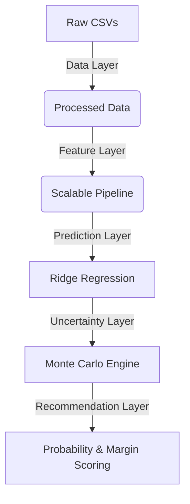

# JoSAA Counselling Analytics: Probabilistic Decision-Support System


An end-to-end machine learning pipeline that transforms 9 years of historical Joint Seat Allocation Authority (JoSAA) admission data into actionable, uncertainty-aware counseling recommendations. 

Traditional cutoff predictors rely on deterministic regression, which is brittle to systemic volatility and changing seat matrices. This system reframes the problem probabilistically, utilizing **Ridge Regression**, **Monte Carlo Simulation**, and **Empirical Residual Mapping** to output 90% confidence intervals and explicit admission probabilities.

---

## 🚀 Key Features

1. **Robust Feature Engineering**: Normalized schema handling for ~70,000 historical cutoffs across evolving Institute and Program names.
2. **High-Accuracy Point Prediction**: L2-regularized Ridge Regression achieving $R^2 > 0.98$ on 2024 test data.
3. **Probabilistic Inference**: Monte Carlo simulation injecting historically derived empirical volatility to generate probabilistic bounds.
4. **Natural Language Explanations**: Automated classification of choices into *Safe*, *Moderate*, and *Ambitious* with LLM-style decision explanations.
5. **Research-Grade Evaluation**: Comprehensive ablation, robustness (rank perturbation), and demographic fairness testing.

---

## 🏗️ Architecture



*(See [architecture.md](architecture.md) for a detailed breakdown.)*

---

## 📊 Results Summary

The evaluation suite (run on the 2024 holdout set) demonstrates the superiority of probabilistic decision support over point prediction.

- **Ablation Studies**: Adding Expected Cutoff Margins guarantees high safety overlap while rejecting over-confident boundary cases.
- **Robustness**: The system maintains a Kendall Tau rank correlation of $>0.95$ across student rank perturbations of $\pm 500$.
- **Feature Importance**: Explicit Opening Rank and Institute Encodings drive the majority of predictive variance.

*(See [research_evaluation_report.md](models/reports/research_evaluation_report.md) for full scientific details.)*

---

## 💻 Quickstart (Inference Pipeline)

### Installation
We guarantee reproducibility via an exact environment snapshot:
```bash
conda env create -f environment.yml
conda activate josaa_analytics
```

### Running Inference
The inference pipeline generates recommendations dynamically based on a JSON student profile:

```bash
cd models
python predict.py '{"rank": 15000, "category": "OPEN", "gender": "Gender-Neutral", "pref_inst": "NIT"}'
```

**Sample Output:**
```json
{
  "institute": "National Institute of Technology, Trichy",
  "program": "Computer Science and Engineering",
  "predicted_cutoff": 13500,
  "admission_probability": 0.425,
  "uncertainty_interval": [13300, 13750],
  "explanation": "National Institute of Technology, Trichy Computer Science and Engineering is classified as a moderate choice because your rank is close to the expected boundary. Volatility could swing the cutoff either way."
}
```

---

## 🧪 Reproducing the Pipeline

To train the models and generate the evaluation artifacts from scratch:
1. `python models/preprocessing.py` (Data Layer)
2. `python models/eda_features.py` (Feature Layer)
3. `python models/train_models.py` (Prediction Layer)
4. `python models/recommendation.py` (Uncertainty Layer)
5. `python models/evaluation.py` (Evaluation Layer)

*(See [reproducibility.md](reproducibility.md) for further environment details and assumptions.)*

---

## 🔮 Future Work

Future iterations will explore:
- **Conformal Prediction** for mathematically guaranteed distribution-free coverage bounds.
- **Graph Neural Networks (GNNs)** to map spatial program preferences.
- **Temporal Transformers** for acceleration forecasting.

*(See [future_work.md](future_work.md) for more details.)*
