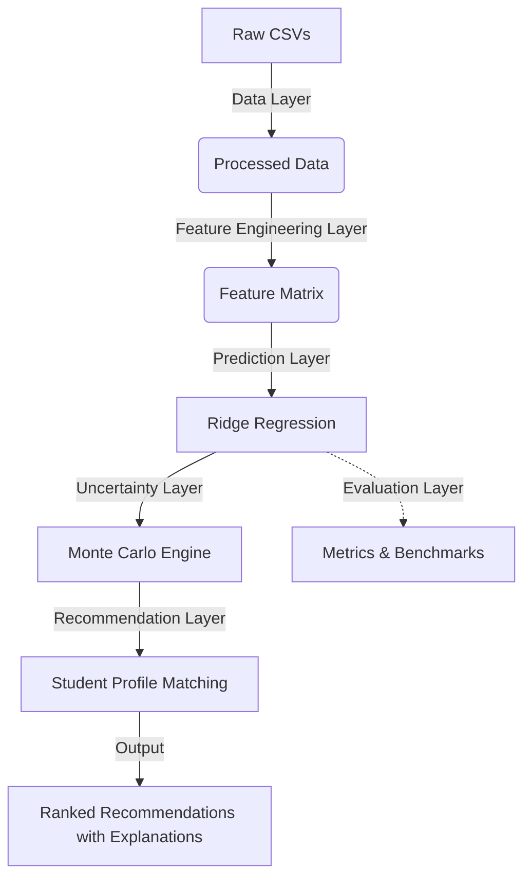

# System Architecture

The JoSAA Counselling Analytics system is designed as an end-to-end machine learning pipeline, transitioning from raw data ingestion to probabilistic recommendation generation.

## High-Level Diagram

## Layer Descriptions

### 1. Data Layer
Handles ingestion of raw JoSAA cutoff and seat matrix CSVs spanning from 2016 to 2024. Normalizes inconsistent institute and program names, resolves schema shifts, and extracts explicit fields (e.g., Duration, Degree Type).

### 2. Feature Engineering Layer
Translates categorical metadata (Institute, Program, Category, Quota, Gender) into high-cardinality label encodings. Applies `StandardScaler` to numerical inputs like year, round, and opening rank. Explicit missing value imputation handles edge-case permutations.

### 3. Prediction Layer
At its core, the system utilizes an L2-regularized `Ridge` regression algorithm ($lpha=10.0$). This provides high accuracy (R² > 0.98) on predicting point-estimates of the closing rank while remaining immune to extreme multicollinearity found in historical cutoff trends.

### 4. Uncertainty Layer
A deterministic point prediction is fragile. The uncertainty layer maps the empirical residual standard deviation of the model grouped by Institute Type and Round, injecting a volatility floor (std $\geq$ 100) to capture macroeconomic shifts. A Monte Carlo engine samples from $\mathcal{N}(\mu_{pred}, \sigma_{empirical})$ to generate predictive distributions.

### 5. Recommendation Layer
Filters the universal program state-space down to the user's explicit profile (Rank, Gender, Category). Calculates absolute Admission Probability ($P(Rank \leq Cutoff)$) and Expected Safety Margin. Ranks options using a weighted composite score and categorizes them into Safe, Moderate, or Ambitious.

### 6. Evaluation Layer
Ensures strict statistical rigor through continuous testing:
- **Ablation Studies**: Proving the added value of Monte Carlo margins over raw prediction.
- **Robustness**: Stress-testing rank boundary perturbations.
- **Fairness**: Measuring uniform accuracy across demographic categories.
