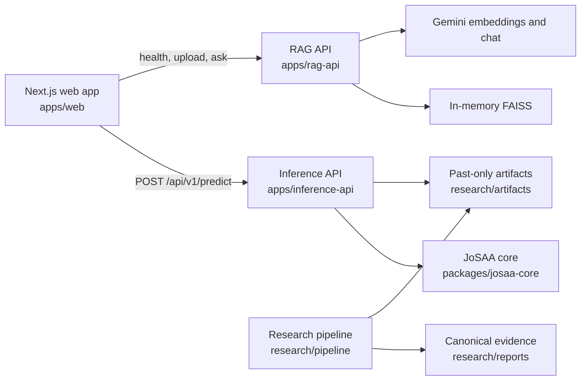

# SeatCraft Development Guide

## 1. Development setup

SeatCraft's primary application consists of a Next.js frontend and two
independent Python FastAPI services. Rust, Cargo, and PostgreSQL are not needed
for normal development.

From the repository root:

```bash
python3 -m venv .venv
. .venv/bin/activate
python -m pip install -r requirements-dev.txt
cp .env.example .env
cd apps/web
npm ci
cd ../..
python scripts/check_assets.py
```

The root `.env` is the single local configuration file. Do not commit it or
print its values. Important variables are:

| Variable | Purpose | Required for normal startup? |
|---|---|---:|
| `NEXT_PUBLIC_ML_URL` | Browser-visible inference API base URL; defaults to `http://localhost:8082` | no |
| `NEXT_PUBLIC_RAG_URL` | Browser-visible RAG API base URL; defaults to `http://localhost:8081` | no |
| `GOOGLE_API_KEY` | Gemini embeddings/chat | no; RAG reports degraded without it |
| `RAG_LLM_MODEL` | Gemini chat model | no |
| `RAG_LLM_MAX_TOKENS` | Gemini response-token bound | no |
| `RAG_EMBED_MODEL` | Gemini embedding model | no |
| `RAG_REQUEST_TIMEOUT_SECONDS` | End-to-end RAG request bound | no |
| `RAG_PROVIDER_TIMEOUT_SECONDS` | Provider-call bound | no |
| `RAG_MAX_UPLOAD_BYTES` | Uploaded-file byte limit | no |
| `RAG_MAX_INLINE_IMAGE_BYTES` | Inline-image byte limit | no |
| `RAG_MAX_ML_CONTEXT_CHARS` | Recommendation-context character bound | no |
| `MC_N_SIMS` | Monte Carlo samples per inference request | no |
| `RUST_SIM_POSTGRES_PASSWORD` | Optional Rust/PostgreSQL profile only | no |

The local data and generated serving artifacts are not legitimate clone-time
dependencies until their provenance and redistribution status is resolved.
`python scripts/check_assets.py` verifies hashes when they are present and
otherwise prints the recovery path. It never downloads or substitutes demo
data.

For process-level development, start the services in separate shells from the
repository root:

```bash
python -m uvicorn inference_api.main:app --host 127.0.0.1 --port 8082
```

```bash
python -m uvicorn rag_api.main:app --host 127.0.0.1 --port 8081
```

```bash
cd apps/web
npm run dev -- --hostname 127.0.0.1 --port 3000
```

Set `NEXT_PUBLIC_ML_URL` or `NEXT_PUBLIC_RAG_URL` only when the corresponding
API is served from a non-default origin.

Default local URLs are `http://localhost:3000` for the frontend,
`http://localhost:8082/api/v1/health` for inference health, and
`http://localhost:8081/health` for RAG health.

## 2. Architecture details



Repository responsibilities:

```text
apps/web/                 Next.js intake, results, saved choices, and advisor
apps/inference-api/       FastAPI artifact loading, filtering, prediction, ranking
apps/rag-api/             FastAPI ingestion, retrieval, Gemini gateway, sources
packages/josaa-core/      Shared feature policy, temporal builders, baselines
research/pipeline/        Preprocessing, training, evaluation, registry tools
research/data/            Local/raw/processed research data; mostly ignored
research/artifacts/       Generated serving model, universe, and contracts
research/reports/         Canonical metrics, tables, figures, verification output
scripts/                  Project verification and safety tooling
optional/rust-sim/        Collaborator-contributed optional experiment
```

The services remain separate modules so their configuration, lifespan,
contracts, failures, and tests can be reasoned about independently. Shared JoSAA
feature-time rules live in the core package rather than being copied into an API
handler. Research code produces artifacts; serving code validates and consumes
them but does not silently retrain.

## 3. Service boundaries

### Web application

`apps/web/` validates the intake, calls the configured Python APIs, and renders
loading, success, empty, degraded, and error states. It displays data cutoff,
model version, prediction year, routed rank type, cutoff interval, uncalibrated likelihood estimate,
heuristic score, bucket counts, and the decision-support disclaimer. Production
failures are never replaced with mock recommendations or advice. Synthetic
network fixtures exist only in labelled automated tests.

Saved choices use stable programme/seat-pool identifiers in browser
`localStorage`. The full recommendation result set is not cached; after reload,
the user reruns the same profile to restore matching saved rows. Storage is
local, unauthenticated, and non-portable.

### Inference API

`apps/inference-api/` owns artifact validation, profile filtering, exam-rank
routing, cutoff inference, Monte Carlo calculation, recommendation ordering,
and explanation metadata. Its public routes are prefixed `/api/v1`:

| Method and path | Responsibility |
|---|---|
| `GET /api/v1/health` | Liveness plus artifact/readiness metadata |
| `GET /api/v1/ready` | `503` until the validated bundle is loaded |
| `POST /api/v1/predict` | Full filtering, inference, ranking, and response contract |
| `POST /api/v1/recommend` | Recommendation-compatible prediction route |
| `POST /api/v1/chat-context` | Bounded recommendation context for the advisor |

Missing, incompatible, or hash-mismatched artifacts keep the service degraded
and expose one sanitized recovery command. IIT rows use Advanced rank;
NIT/IIIT/GFTI rows use Main rank. The API returns `rank_used`,
`rank_type_used`, candidate counts, actual bucket counts, empirical prediction
intervals, and separate likelihood/heuristic fields.

### RAG API

`apps/rag-api/` owns document validation, PDF extraction, provider-dependent
image transcription, chunking, embeddings, FAISS retrieval, prompt boundaries,
Gemini chat, and source excerpts:

| Method and path | Responsibility |
|---|---|
| `GET /health` | Provider, vector-store, model, and degraded-state summary |
| `GET /ready` | `503` until embedding, chat, and vector dependencies are ready |
| `POST /api/rag/upload` | Validate, extract, chunk, embed, and index a document |
| `POST /api/rag/ask` | Retrieve context and invoke chat with optional ML context/image |
| `GET /api/rag/status` | In-memory document/chunk status |

The API bounds filenames, bytes, pages, extracted characters, question length,
ML context, and provider/request time. Logs record operation/error types rather
than private document or provider details. Source name, excerpt, page, and chunk
index are returned when retrieval finds context.

### Research and evidence

`research/pipeline/` is offline code. It creates the versioned result tables and
local serving bundle under `research/reports/` and `research/artifacts/`.
`research/reports/metrics.json` is the numeric source of truth. The API/UI and
documentation must not introduce a metric that is absent from that evidence or
whose dataset hash differs from the manifest.

## 4. Testing strategy

The main verification entry point is:

```bash
python scripts/verify_project.py
```

It writes sanitized JSON evidence under
`research/reports/verification/`. The report for the current run—not a copied
historical count—is authoritative for pass, fail, skip, environment, and live
provider status.

Focused checks are:

```bash
python -m compileall -q research/pipeline packages/josaa-core/src \
  apps/inference-api/src apps/rag-api/src scripts
python -m ruff check research/pipeline packages/josaa-core/src \
  apps/inference-api/src apps/rag-api/src scripts --select E9,F63,F7,F82
python -m pytest research/pipeline/tests -q
python -m pytest apps/inference-api/tests -q
python -m pytest apps/rag-api/tests -q
python scripts/verify_readme.py
```

```bash
cd apps/web
npm test
npm run lint
npm run typecheck
npm run build
npm run test:e2e
```

```bash
docker compose config --quiet
docker compose config --services
python scripts/scan_secrets.py --history
```

The research suite covers feature-time availability, strict lags, target-frame
construction, coverage accounting, completed-round guards, holdout isolation,
OOF uncertainty, pre-final selection, deterministic behaviour, manifest hashes,
and the precise missing-data failure.

Inference tests cover startup/readiness, artifact schema and hashes, unsafe
deserialization guards, validation, exact category/gender/PwD/quota/round/
institute/branch filters, conservative home-state handling, Main/Advanced rank
routing, likelihood monotonicity, deterministic Monte Carlo, interval order,
score-versus-likelihood separation, bucket balancing, stable IDs, candidate
counts, context construction, and sanitized errors. A retained regression case
uses Main rank 3000, Advanced rank 6700, and `top_n=100`, and asserts that both
rank sources appear when eligible data supports them.

RAG tests inject fake embedding/chat gateways. They verify health and degraded
states, actual gateway invocation, missing-key/provider/timeout failures,
extension/MIME/signature/size checks, PDF extraction, image validation, text
chunking, FAISS insertion/retrieval, empty-store behaviour, ML context, prompt
injection boundaries, source metadata, and sanitized errors. These tests do not
prove real provider connectivity or OCR quality.

Frontend unit and mocked Playwright tests cover intake validation, the exact
prediction contract, loading/success/error rendering, metadata and disclaimer,
sorting/filtering, actual backend bucket use, saved-choice persistence and
malformed storage, advisor health/upload/ask/sources, visible provider failures,
mobile behaviour, and the repository link. `npm run test:e2e` uses labelled
network fixtures. With all real local services running, use:

```bash
cd apps/web
PLAYWRIGHT_BASE_URL=http://127.0.0.1:3000 npm run test:e2e:full-stack
```

That distinct command exercises real local APIs; it still does not establish a
live Gemini pass unless the provider verifier succeeds.

## 5. Live Gemini verification

Normal CI does not make paid Gemini requests. Live verification is explicit:

```bash
RUN_LIVE_GEMINI_TEST=1 python scripts/verify_gemini.py
```

The script loads the root `.env` and the service-local `apps/rag-api/.env`
fallback without printing the key, makes one real
embedding request and one short real chat request, applies short timeouts, and
prints only sanitized provider, model, latency, timestamp, and status evidence.
It never substitutes a mock. The standalone script ends with exactly one of:

- `LIVE GEMINI TEST: SUCCESS` when both real calls succeed;
- `LIVE GEMINI TEST: FAILURE` when an attempted live call fails; or
- `LIVE GEMINI TEST: NOT RUN` when opt-in or credentials are absent.

The consolidated verifier normalizes these outcomes to `LIVE GEMINI: PASSED`,
`LIVE GEMINI: FAILED`, or `LIVE GEMINI: NOT RUN` for the README and JSON report.

A mocked gateway pass and a healthy-looking configuration are not equivalent to
live connectivity.

## 6. Docker workflows

The default stack is Python/Next.js only:

```bash
docker compose up --build
```

It starts the Compose services `inference-api`, `rag-api`, and `web`. Inference is
published on 8082, RAG on 8081, and the web app on 3000. The frontend waits for
the service health checks. RAG is allowed to report a clear degraded state when
Gemini is not configured; inference readiness requires the validated artifact
bundle.

Validate configuration before startup:

```bash
docker compose config --quiet
docker compose config --services
```

The default service list must not contain PostgreSQL, the Rust server, or Rust
ingestion. The inference image uses the repository-root build context so it can
install `packages/josaa-core/`; its Dockerfile remains under
`apps/inference-api/`. RAG and web use their narrower `apps/rag-api/` and
`apps/web/` contexts. Research artifacts are exposed to inference read-only as
configured by Compose. One root `.env` supplies the documented variables.

The optional collaborator experiment has a separate profile described in
Section 10.

## 7. Five-minute demonstration script

### 0:00–0:40 — State the boundary

Open the README and say:

> “SeatCraft is decision support, not an admission guarantee. The primary
> implementation is the Python research/inference pipeline, Gemini RAG
> integration, frontend, testing, evaluation, and documentation. The Rust
> directory is an optional collaborator experiment and is not part of this
> demo.”

Point out that the result is hash-bound but exploratory, and that clean-clone
research reproduction remains blocked until data provenance and permission are
recorded.

### 0:40–1:30 — Show the methodology correction

Open `research/reports/metrics.json` and the technical report:

- reject the availability-invalid legacy MAE of roughly 2.43;
- show 2021–2024 selection: last year 2,535.46 MAE, HGB 2,878.39, Ridge
  6,800.97;
- show pipeline-held-out 2025: selected MAE 2,504.75, median error 422, R² 0.79269;
- show nominal 90% interval coverage 91.70%; and
- show target-universe coverage 74.77%.

Explain that a simple baseline winning is a useful negative result and the next
model must beat it without target-time leakage.

### 1:30–2:20 — Check assets and health

```bash
python scripts/check_assets.py
curl http://localhost:8082/api/v1/health
curl http://localhost:8081/health
```

Show the data cutoff, model version, prediction year, feature mode, artifact
readiness, provider models, and degraded reasons. If Gemini is unavailable,
state that directly; do not imply a live call passed.

### 2:20–3:35 — Submit the regression profile

Enter:

- JEE Main rank `3000`;
- JEE Advanced rank `6700`;
- an appropriate test home state;
- OPEN category, Gender-Neutral, non-PwD; and
- `top_n=100` through the API/default UI contract.

Show that IIT rows use Advanced 6700 and NIT/IIIT/GFTI rows use Main 3000.
Compare the uncalibrated cutoff-exceedance likelihood estimate with the separate recommendation
score, inspect the 90% empirical prediction interval and rank source, filter
safe/realistic/reach rows, and use candidate/bucket counts to explain why a
fixed number of reaches is not promised. Save one option. Reload and rerun the
same profile to show matching local choice persistence; do not claim that the
full result set was cached.

### 3:35–4:20 — Demonstrate the advisor honestly

Open the advisor and show health before asking. Upload a small non-private PDF,
ask about ordering the displayed choices, and open a returned source excerpt.
Explain that the service receives bounded ML context, retrieves from in-memory
FAISS, and calls Gemini through an injectable gateway. If the provider is
unavailable, show the real degraded/error state instead of a fake answer.

### 4:20–5:00 — Close with evidence and next work

Open or generate the latest report:

```bash
python scripts/verify_project.py
```

Summarize the actual recorded research, API, mocked-RAG, frontend, browser,
Compose, README-contract, and secret checks. State the normalized live Gemini
result exactly as `LIVE GEMINI: PASSED`, `LIVE GEMINI: FAILED`, or
`LIVE GEMINI: NOT RUN`. End with temporal-shift conformal prediction,
hierarchical/seat-matrix cold start, and preference-supervised learning-to-rank.

## 8. Interview talking points

- Detecting target-time leakage changed the story from implausible near-perfect
  performance to an honest baseline-winning experiment.
- Pre-final selection prevents changing the objective after seeing 2025.
- Constructing the target frame from a prior snapshot exposes the real 74.77%
  universe-coverage boundary.
- OOF residuals isolate interval construction from the final test; the result
  is called an empirical prediction interval, never a confidence interval.
- Main/Advanced routing, profile filters, bucket counts, and per-row rank source
  make the recommendation contract auditable.
- Uncalibrated likelihood estimate, empirical interval, heuristic score, and
  recommendation bucket are four separate concepts in the API and UI.
- Dependency injection lets mocked RAG tests prove calls and failures without
  pretending they prove provider connectivity.
- The system fails closed on absent/unlicensed assets and makes provider
  degradation visible instead of silently serving fake data.
- A simple baseline winning is a defensible negative result and a stronger
  future benchmark than an inflated accuracy claim.

## 9. Contribution boundaries

This repository contains work from more than one contributor. The primary
scope represented by the `RAG` branch is the Python ML/research and inference
pipeline, Gemini-backed retrieval integration, automated testing, frontend
integration, evaluation tooling, and research/reproducibility documentation.

`optional/rust-sim/` is collaborator-contributed work. It is preserved as an
explicitly optional experiment, is not required by the default application or
evidence pipeline, and must not be presented as the primary contributor's
implementation. PostgreSQL is likewise used only by that optional profile.

This is a component ownership boundary, not an invented line-by-line authorship
history. Git history remains the source of truth for individual changes. In a
presentation or interview:

- present the Python forecasting/inference work, RAG integration, tests,
  frontend integration, evaluation, and documentation as the primary project;
- describe Rust directly as an optional collaborator experiment;
- do not use Rust implementation, performance, or demo-data claims as primary
  architecture or research evidence; and
- answer questions about the Rust directory by stating this boundary plainly.

## 10. Optional Rust workflow

Run the collaborator-contributed experiment only through its explicit profile:

```bash
docker compose --profile rust-sim up --build
```

This profile adds PostgreSQL, the Rust ingestion job, and the Rust server. It may
use `RUST_SIM_POSTGRES_PASSWORD` and publishes the optional server on its
configured Rust port. Its code lives under `optional/rust-sim/`. The historical
collaborator CSV at that path is intentionally untracked in the current
tree because its source, license, and redistribution basis are unresolved.
Users may supply that exact local path only when they have an authorized input;
it is not primary research data.

The default `docker compose up --build` must remain independent of Rust, Cargo,
and PostgreSQL. The optional CSV has mock-data edits in repository history and
must never replace the provenance-blocked research dataset or contribute to the
primary metrics.

## 11. Known engineering limitations

- Clean-clone inference readiness is intentionally blocked until legitimate
  source data can regenerate the model and 2026 universe.
- Gemini connectivity, quotas, model availability, latency, and pricing are
  external. Missing/invalid credentials must remain a degraded or failed state.
- FAISS vectors and document metadata are in memory and disappear on restart;
  persistence, multi-user isolation, deletion controls, and retrieval-quality
  benchmarks are not implemented.
- PDF limits and signature validation reduce risk but do not constitute a full
  untrusted-document sandbox. Image transcription is provider-dependent and has
  no measured OCR-accuracy claim.
- Generated answers may hallucinate or misread policy. Source excerpts improve
  inspectability but do not make the advisor authoritative.
- Browser-saved choices are unauthenticated, device-local identifiers. They are
  not portable accounts or a server-side saved list.
- Free-text branch matching can omit relevant programmes; empty results should
  prompt the user to broaden filters.
- The dataset lacks an authoritative institute-to-state mapping, so home-state
  rows are conservatively excluded unless eligibility can be proven.
- The admission-likelihood estimate is an uncalibrated Monte Carlo result under a historical
  residual assumption. The recommendation score remains heuristic.
- Mocked browser/RAG tests prove deterministic application behaviour, while the
  real-stack browser test and opt-in Gemini verifier answer separate integration
  questions.
- Local success does not prove hosted CI until changes are pushed and the
  authoritative workflow completes; this working tree is intentionally left
  uncommitted by the restructuring task.
